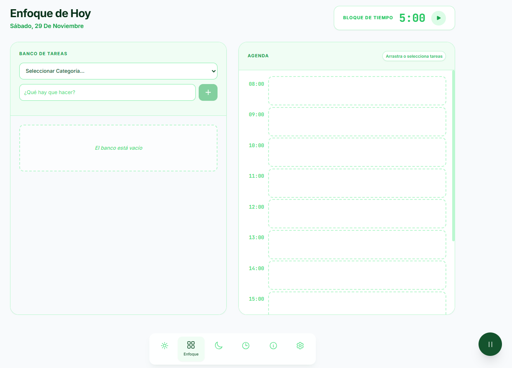
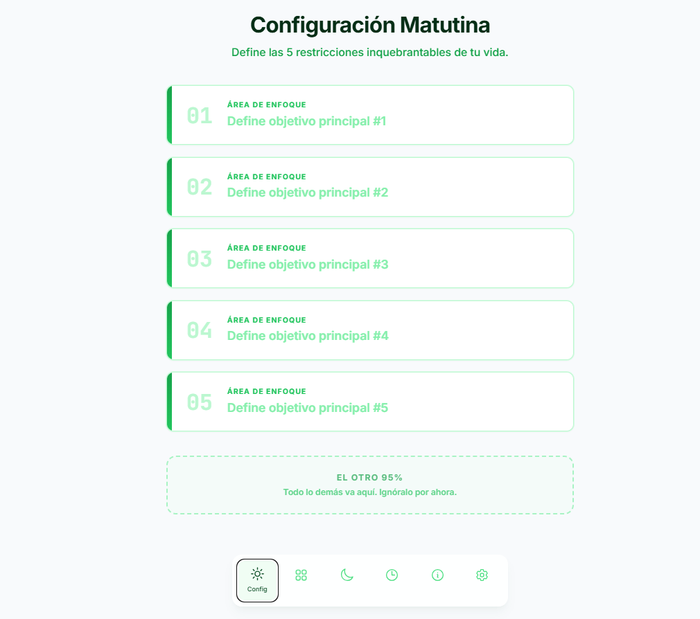
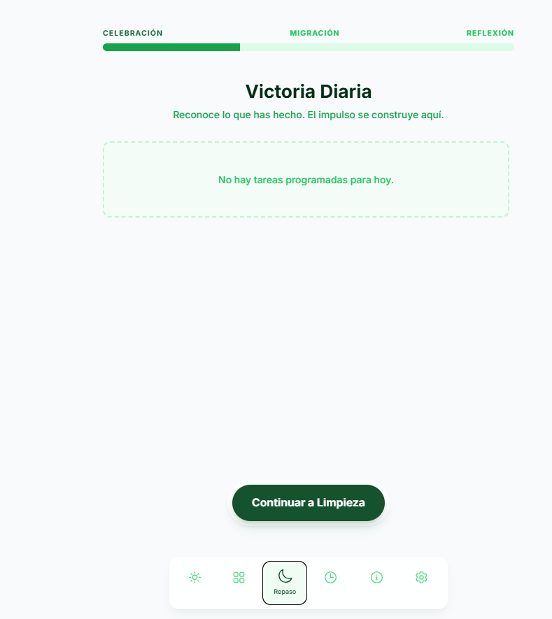
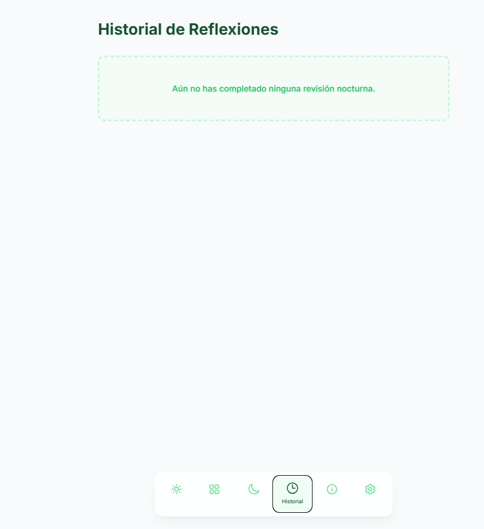
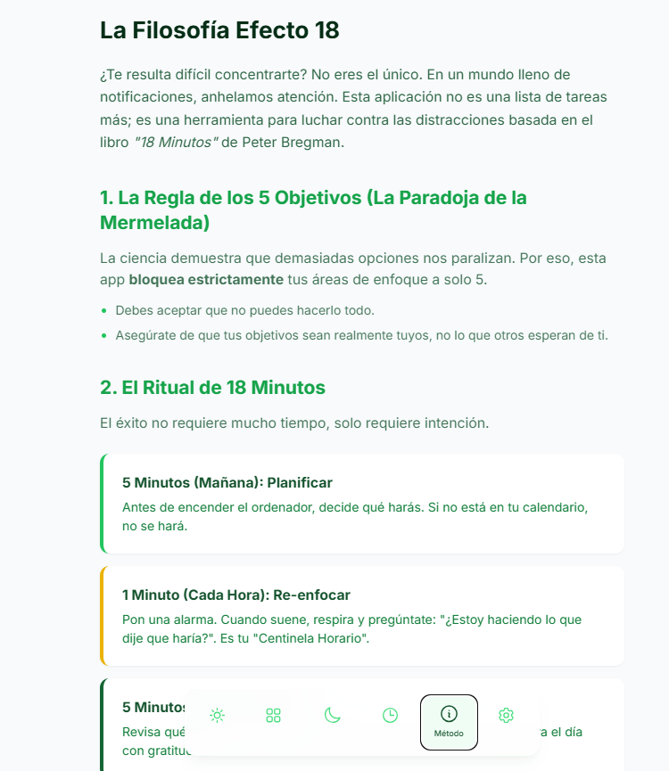
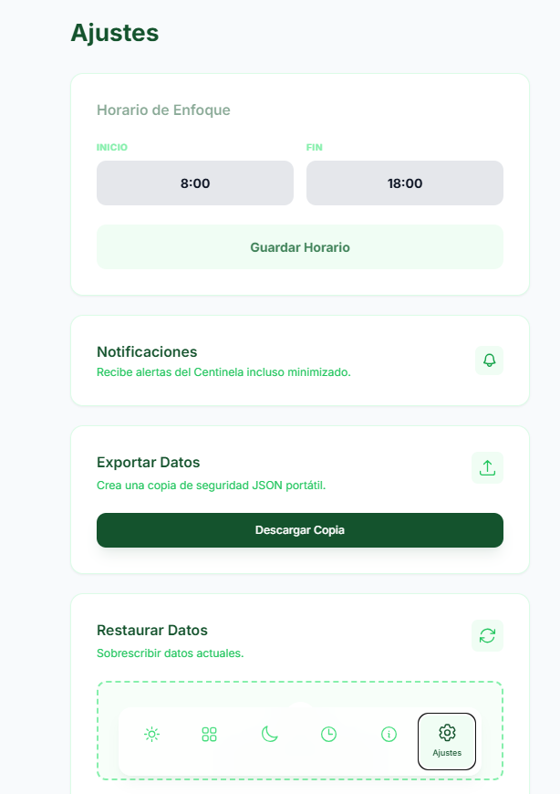

# ⚡ Efecto 18: AI-Driven Productivity PWA

)
> **Una implementación técnica de la metodología "18 Minutos" de Peter Bregman, desarrollada mediante Ingeniería de Prompts avanzada y Arquitectura de Software asistida por IA.**

[🔗 **Ver Demo en Vivo**](https://ai.studio/apps/drive/1-1LToRckq3LC-XKoO5tmMvUdHQ51iybk) | [📄 **Ver Prompt Original**](https://ai.studio/apps/drive/1-1LToRckq3LC-XKoO5tmMvUdHQ51iybk)
---

## 🎯 Visión del Proyecto

El objetivo no era simplemente "crear una To-Do list", sino traducir principios psicológicos complejos (gestión de la atención, *time-boxing* y pausa reflexiva) en una **Arquitectura de Software** funcional.

La aplicación actúa como un "Centinela de la Atención", utilizando **Service Workers** y **Almacenamiento Local (IndexedDB)** para funcionar completamente offline, respetando la privacidad y eliminando la latencia.

---

## 📸 Tour Visual de la Aplicación

El diseño sigue estrictamente los principios de "Cognitive Ease": interfaces limpias, alto contraste para acciones clave y ocultación de elementos no esenciales.

| **1. Configuración & Setup** | **2. Planificación del Día** |
|:---:|:---:|
|  |  |
| *Definición de las 5 Áreas de Enfoque* | *Time-Boxing y Drag & Drop* |

| **3. Ejecución (El Centinela)** | **4. Modo Foco** |
|:---:|:---:|
|  |  |
| *Verificación de Intención vs. Acción* | *Vista minimalista durante el trabajo* |

| **5. Protocolo de Pausa** | **6. Revisión Nocturna** |
|:---:|:---:|
|  |  |
| *Intervención de "Respiración" antes de distracciones* | *Cierre de loops y limpieza de datos* |

## 🤖 El Rol del Desarrollador en la Era de la IA

Este proyecto sirve como demostración práctica de cómo el rol del desarrollador evoluciona de "escribir código" a "orquestar soluciones". 

**Metodología de Desarrollo:**
1.  **Análisis de Dominio:** Desglose de un libro de no-ficción en requerimientos funcionales y UI/UX.
2.  **Arquitectura de Datos:** Diseño del esquema de base de datos (IndexedDB) y lógica de estado.
3.  **Ingeniería de Prompts (One-Shot):** Creación de un contexto técnico denso y preciso para que la IA (LLM) generara la estructura base, lógica y estilos en una sola iteración coherente.
4.  **Refinamiento y Despliegue:** Auditoría de código, optimización de assets con Vite y despliegue.

---

## 🛠 Habilidades Demostradas (Skills Matrix)

### 🧠 Hard Skills (Técnicas)
| Área | Tecnologías / Conceptos |
| :--- | :--- |
| **Frontend Moderno** | React/Vanilla JS, Vite, Tailwind CSS (Utility-first CSS). |
| **PWA & Offline-First** | Manipulación de **IndexedDB** para persistencia de datos compleja sin backend. |
| **AI Engineering** | **Prompt Engineering** avanzado (Context Framing, Constraint Setting, One-Shot generation). |
| **Arquitectura** | Diseño de sistemas modulares y gestión de estado asíncrono. |
| **Data Security** | Implementación de sistemas de Backup/Restore (JSON) del lado del cliente. |

### 💡 Soft Skills (Estratégicas)
* **Traducción de Negocio a Técnico:** Capacidad para leer un texto abstracto (libro de negocios) y convertirlo en *features* de software tangibles.
* **Gestión de Producto:** Priorización de funcionalidades (MVP) basada en el valor central (el "Foco" sobre la "Gestión").
* **Adaptabilidad:** Uso de herramientas de IA para acelerar el tiempo de desarrollo (Time-to-market) en un 80%.
* **Pensamiento Crítico:** Evaluación de las limitaciones de la IA y corrección de la lógica de negocio.

---

## 📱 Características Clave (Features)

* **🛡️ The 5-Category Limit:** Restricción *hard-coded* que impide crear más de 5 objetivos, forzando la priorización (Paradoja de la elección).
* **⏳ Time Boxing:** Interfaz *Drag & Drop* para asignar tareas a horas específicas.
* **🚨 El Centinela Horario:** Sistema de validación de foco que interrumpe el piloto automático.
* **🧘 Modo Pausa (Blur):** UI reactiva que bloquea inputs para forzar ejercicios de respiración antes de decisiones impulsivas.
* **💾 Local-First:** Privacidad total. Los datos viven en el dispositivo del usuario.

---

## 🚀 Cómo ejecutarlo localmente

Este proyecto utiliza **Vite** para una experiencia de desarrollo ultrarrápida.

```bash
# 1. Clonar el repositorio
git clone [https://github.com/](https://github.com/)[TU_USUARIO]/efecto-18-pwa.git

# 2. Instalar dependencias
npm install

# 3. Iniciar servidor de desarrollo
npm run dev

# 4. Construir para producción
npm run build

<div align="center">

</div>

# Run and deploy your AI Studio app

This contains everything you need to run your app locally.

View your app in AI Studio: https://ai.studio/apps/drive/1-1LToRckq3LC-XKoO5tmMvUdHQ51iybk

## Run Locally

**Prerequisites:**  Node.js


1. Install dependencies:
   `npm install`
2. Set the `GEMINI_API_KEY` in [.env.local](.env.local) to your Gemini API key
3. Run the app:
   `npm run dev`
